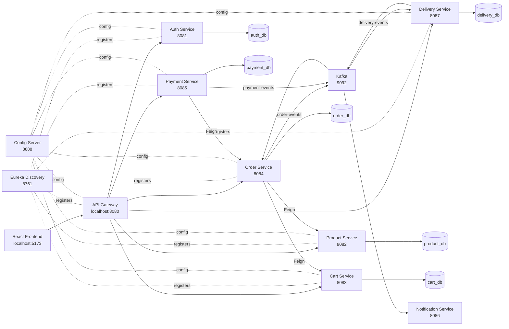

# QuickCart

QuickCart is a 10-minute delivery platform built as a Spring Boot microservices system with a React TypeScript frontend. It demonstrates service discovery, API gateway routing, centralized configuration, JWT authentication, Google OAuth2 login, role-based access control, Kafka eventing, Feign-based service communication, payment idempotency, and delivery-to-order status synchronization.


## Highlights

- Microservices architecture with Spring Boot 3 and Java 21
- React + TypeScript frontend built with Vite
- API Gateway as the single public backend entry point
- Eureka service discovery
- Spring Cloud Config Server with native local config files
- JWT access tokens and refresh tokens
- Google OAuth2 customer login
- Role-based authorization for `CUSTOMER`, `STORE`, and `DELIVERY`
- Manual protected onboarding endpoint for store and delivery accounts
- PostgreSQL database per service
- Kafka topics for order, payment, and delivery events
- Payment idempotency using `X-Idempotency-Key`
- Delivery status events consumed by Order Service to keep order status in sync
- Swagger/OpenAPI UI for service-level API exploration
- Resilience4j circuit breakers and retries around cross-service calls

## Architecture



## Service Map

| Service | Port | Responsibility |
| --- | ---: | --- |
| API Gateway | 8080 | Public backend entry point, routing, JWT validation |
| Auth Service | 8081 | Registration, login, Google OAuth2, refresh tokens, role onboarding |
| Product Service | 8082 | Product catalog, store CRUD, stock deduction |
| Cart Service | 8083 | Customer cart management |
| Order Service | 8084 | Place orders, order history, order status sync |
| Payment Service | 8085 | Payment simulation, idempotency, payment events |
| Notification Service | 8086 | Kafka event logging for order/payment/delivery notifications |
| Delivery Service | 8087 | Delivery assignment, status updates, OTP verification |
| Config Server | 8888 | Centralized service configuration |
| Discovery Server | 8761 | Eureka service registry |

## Tech Stack

**Backend**

- Java 21
- Spring Boot 3.2.5
- Spring Cloud 2023.0.1
- Spring Cloud Gateway
- Spring Cloud Config
- Eureka Discovery
- Spring Security
- Spring OAuth2 Client
- JJWT
- Spring Data JPA
- PostgreSQL
- Spring Kafka
- OpenFeign
- Resilience4j
- Springdoc OpenAPI

**Frontend**

- React 19
- TypeScript
- Vite
- React Router

**Infrastructure**

- Kafka
- Zookeeper
- Docker Compose
- Maven Wrapper

## Domain Flow

### 1. Authentication

- Public registration creates `CUSTOMER` accounts only.
- Google OAuth2 login also creates/logs in customer accounts only.
- `STORE` and `DELIVERY` accounts are created through a protected manual admin endpoint.
- Login returns an access token and refresh token.
- The frontend stores tokens in local storage and refreshes access tokens on `401`.

### 2. Customer Order Flow

1. Customer registers or logs in.
2. Customer browses products.
3. Customer adds products to cart.
4. Customer places an order.
5. Order Service deducts stock through Product Service.
6. Order Service clears cart through Cart Service.
7. Order Service publishes `order-events`.
8. Customer pays through Payment Service.
9. Payment Service updates order status and publishes `payment-events`.
10. Delivery Service consumes successful payment events and creates delivery records.
11. Delivery Service publishes `delivery-events`.
12. Order Service consumes delivery events and syncs order status to `ASSIGNED`, `OUT_FOR_DELIVERY`, `DELIVERED`, or `FAILED`.

### 3. Store Flow

- Store users log in through the normal login page.
- Store users can create, update, and delete products.
- Public customer registration cannot create store users.

### 4. Delivery Flow

- Delivery users log in through the normal login page.
- Delivery users can see assigned deliveries.
- Delivery users can move deliveries through status updates.
- OTP verification marks delivery as delivered.
- Delivery status changes are published to Kafka and reflected in Order Service.

## Kafka Topics

| Topic | Producer | Consumers | Purpose |
| --- | --- | --- | --- |
| `order-events` | Order Service | Notification Service | Notify that an order was placed |
| `payment-events` | Payment Service | Delivery Service, Notification Service | Create delivery after successful payment and notify payment result |
| `delivery-events` | Delivery Service | Order Service, Notification Service | Sync order status and notify delivery updates |

## Local Setup

### Prerequisites

- Java 21
- Node.js 20 or later
- Docker Desktop
- PostgreSQL running locally on port `5432`
- Maven Wrapper is included, so a separate Maven installation is not required

### 1. Clone the repository

```bash
git clone <your-repo-url>
cd QuickCart
```

### 2. Start Kafka and Zookeeper

```bash
docker compose up -d
```

This starts:

- Zookeeper on `2181`
- Kafka on `9092`

### 3. Create PostgreSQL databases

The config server expects these local databases:

```sql
CREATE DATABASE auth_db;
CREATE DATABASE product_db;
CREATE DATABASE cart_db;
CREATE DATABASE order_db;
CREATE DATABASE payment_db;
CREATE DATABASE delivery_db;
```

Default local database credentials in the config files are:

```text
username: postgres
password: password
```

Update the Config Server files under `config-server/src/main/resources/configs/` if your local PostgreSQL credentials are different.

### 4. Configure local secrets

For Google OAuth2 and privileged user onboarding, export these before starting the backend:

```bash
export GOOGLE_CLIENT_ID="your-google-client-id"
export GOOGLE_CLIENT_SECRET="your-google-client-secret"
export ADMIN_SETUP_KEY="choose-a-local-admin-setup-key"
```

`ADMIN_SETUP_KEY` is only used to protect the manual endpoint that creates `STORE` and `DELIVERY` users.

### 5. Google OAuth2 setup

In Google Cloud Console, configure an OAuth client for a web application.

Authorized redirect URI:

```text
http://localhost:8080/auth/login/oauth2/code/google
```

Frontend OAuth callback used by this app:

```text
http://localhost:5173/oauth2/redirect
```

The backend receives Google's callback through API Gateway, creates or loads the customer account, generates JWT tokens, and redirects the browser back to the frontend callback route.

### 6. Start the backend

Start services manually in this order:

```bash
./mvnw -f discovery-server/pom.xml spring-boot:run
./mvnw -f config-server/pom.xml spring-boot:run
./mvnw -f auth-service/pom.xml spring-boot:run
./mvnw -f product-service/pom.xml spring-boot:run
./mvnw -f cart-service/pom.xml spring-boot:run
./mvnw -f order-service/pom.xml spring-boot:run
./mvnw -f payment-service/pom.xml spring-boot:run
./mvnw -f delivery-service/pom.xml spring-boot:run
./mvnw -f notification-service/pom.xml spring-boot:run
./mvnw -f api-gateway/pom.xml spring-boot:run
```

### 7. Start the frontend

```bash
cd frontend
npm install
npm run dev
```

Frontend runs at:

```text
http://localhost:5173
```

Backend gateway runs at:

```text
http://localhost:8080
```

## Creating Users

### Customer

Customers self-register from the frontend.

Public registration always creates:

```text
role = CUSTOMER
```

### Store

Create store users manually through the protected admin endpoint:

```bash
curl -X POST http://localhost:8080/auth/admin/users \
  -H "Content-Type: application/json" \
  -H "X-Admin-Setup-Key: choose-a-local-admin-setup-key" \
  -d '{
    "name": "Store Owner",
    "email": "store@example.com",
    "password": "Store@123",
    "role": "STORE"
  }'
```

Then log in normally from the frontend with that email and password.

### Delivery

Create delivery users manually the same way:

```bash
curl -X POST http://localhost:8080/auth/admin/users \
  -H "Content-Type: application/json" \
  -H "X-Admin-Setup-Key: choose-a-local-admin-setup-key" \
  -d '{
    "name": "Delivery Partner",
    "email": "delivery@example.com",
    "password": "Delivery@123",
    "role": "DELIVERY"
  }'
```

Then log in normally from the frontend.

## API Overview

All user-facing requests should go through API Gateway:

```text
http://localhost:8080
```

### Auth

| Method | Path | Description |
| --- | --- | --- |
| POST | `/auth/register` | Register a customer |
| POST | `/auth/login` | Email/password login |
| POST | `/auth/refresh` | Refresh access token |
| GET | `/auth/oauth2/authorization/google` | Start Google login |
| POST | `/auth/admin/users` | Create `STORE` or `DELIVERY` user with setup key |

### Products

| Method | Path | Role | Description |
| --- | --- | --- | --- |
| GET | `/products` | Customer, Store | List products |
| GET | `/products/{id}` | Customer, Store | Get product by ID |
| GET | `/products/filter` | Customer, Store | Filter products |
| POST | `/products` | Store | Create product |
| PUT | `/products/{id}` | Store | Update product |
| DELETE | `/products/{id}` | Store | Delete product |

### Cart

| Method | Path | Role | Description |
| --- | --- | --- | --- |
| GET | `/cart` | Customer | View cart |
| POST | `/cart/add` | Customer | Add item |
| PUT | `/cart/update/{id}` | Customer | Update item quantity |
| DELETE | `/cart/remove/{id}` | Customer | Remove item |
| DELETE | `/cart/clear` | Customer | Clear cart |

### Orders

| Method | Path | Role | Description |
| --- | --- | --- | --- |
| POST | `/order/place` | Customer | Place order |
| GET | `/order` | Customer | View own orders |
| GET | `/order/{id}` | Customer | View own order by ID |

### Payments

| Method | Path | Role | Description |
| --- | --- | --- | --- |
| POST | `/payment/process` | Customer | Process simulated payment |

Payment supports idempotency:

```text
X-Idempotency-Key: <client-generated-uuid>
```

### Delivery

| Method | Path | Role | Description |
| --- | --- | --- | --- |
| GET | `/delivery` | Delivery | List deliveries |
| GET | `/delivery/{orderId}` | Delivery | Get delivery by order ID |
| PUT | `/delivery/{orderId}/status` | Delivery | Update delivery status |
| POST | `/delivery/{orderId}/verify-otp` | Delivery | Verify delivery OTP |

## Swagger UI

Each service exposes Swagger UI when running:

```text
http://localhost:<service-port>/swagger-ui/index.html
```

Examples:

```text
http://localhost:8081/swagger-ui/index.html
http://localhost:8082/swagger-ui/index.html
http://localhost:8083/swagger-ui/index.html
http://localhost:8084/swagger-ui/index.html
http://localhost:8085/swagger-ui/index.html
http://localhost:8087/swagger-ui/index.html
```

## Build and Verification

Compile all backend modules:

```bash
./mvnw -DskipTests compile
```

Build frontend:

```bash
cd frontend
npm run build
```

Check frontend linting:

```bash
cd frontend
npm run lint
```

## Project Structure

```text
QuickCart/
|-- api-gateway/           # Gateway routing and JWT validation
|-- auth-service/          # Authentication, OAuth2, refresh tokens, role onboarding
|-- cart-service/          # Customer cart
|-- common-lib/            # Shared DTOs, events, exceptions, gateway auth filter
|-- config-server/         # Spring Cloud Config Server
|-- delivery-service/      # Delivery assignment, status, OTP
|-- discovery-server/      # Eureka server
|-- frontend/              # React TypeScript UI
|-- notification-service/  # Kafka notification consumer
|-- order-service/         # Order placement and status lifecycle
|-- payment-service/       # Payment processing and idempotency
|-- product-service/       # Product catalog and stock
|-- legacy-monolith/       # Earlier monolithic version kept for reference
|-- docker-compose.yml     # Kafka and Zookeeper
|-- pom.xml                # Parent Maven project
`-- start-backend.sh       # Local backend startup helper
```

## Design Decisions

### Gateway-trusted identity headers

The frontend sends JWTs to API Gateway. Gateway validates the access token, removes spoofable identity headers, and forwards trusted user headers such as user ID, email, and role to downstream services. Downstream services enforce method-level role checks with `@PreAuthorize`.

### Public customer registration only

Public signup creates customers only. Store and delivery accounts are privileged accounts and must be created manually through a protected setup endpoint.

### Access token plus refresh token

Short-lived access tokens reduce the impact of token leakage. Refresh tokens allow the frontend to recover from expired access tokens without forcing the user to log in again.

### Payment idempotency

Payment processing accepts an `X-Idempotency-Key`. If the same payment request is retried after a network issue, the service can return the existing payment result instead of creating duplicate payment records.

### Event-driven delivery synchronization

Delivery Service emits `delivery-events` whenever delivery status changes. Order Service consumes those events and updates the customer-visible order status. This closes the gap where delivery state could move forward while the order remained stale.

### Distributed transaction boundary

`@Transactional` protects only the local service database. Cross-service operations such as stock deduction, cart clearing, Kafka publishing, and payment/delivery updates are separate transactions. A production-grade version would use Saga orchestration/choreography, compensating actions, idempotent commands, and transactional outbox patterns.


