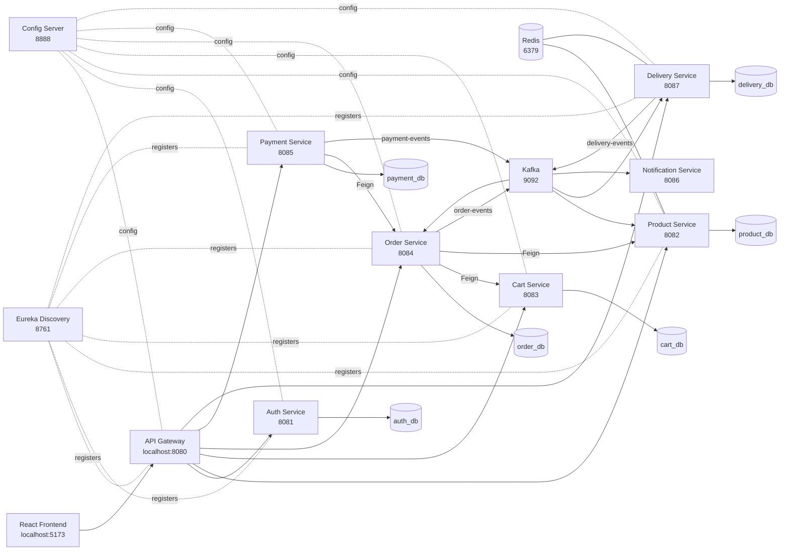

# QuickCart

QuickCart is a 10-minute grocery delivery platform built as a Spring Boot microservices system with a React TypeScript frontend. It demonstrates a dark store network with location-aware catalog filtering, pessimistic-locking stock reservations with Kafka-driven confirmation/release, GPS-based nearest store lookup via Redis GEO, OTP-verified delivery with email notifications, JWT authentication, Google OAuth2 login, role-based access control, payment idempotency, and full delivery-to-order status synchronization.


## Highlights

- Microservices architecture with Spring Boot 3 and Java 21
- React + TypeScript frontend built with Vite
- API Gateway as the single public backend entry point — validates JWTs, strips spoofable headers, forwards trusted user context
- Eureka service discovery
- Spring Cloud Config Server with per-service YAML config files
- JWT access tokens and refresh tokens
- Google OAuth2 customer login
- Role-based authorization for `CUSTOMER`, `STORE`, and `DELIVERY`
- Protected onboarding endpoint for `STORE` and `DELIVERY` accounts
- 22 dark stores across India seeded on startup, loaded into Redis GEO
- Redis GEO `GEOSEARCH` for sub-millisecond nearest-store lookups (8 km radius)
- Per-store inventory: each `(store_id, product_id)` pair has its own stock row
- Pessimistic-write-locked stock reservations — stock is soft-locked on order creation
- Reservation lifecycle: `RESERVED → CONFIRMED` (payment success) or `RELEASED` (payment failure)
- Scheduled cleanup job expires stale reservations and restores stock after 10-minute TTL
- Stock reservations are idempotent — duplicate order events are detected and short-circuited
- PostgreSQL database per service
- Kafka topics for order, payment, and delivery events
- Product Service consumes `payment-events` to confirm or release stock reservations asynchronously
- Payment idempotency using `X-Idempotency-Key`
- OTP-based delivery verification — 6-digit OTP generated in Redis with 5-minute TTL, emailed to customer
- OTP resend and max-attempts enforcement (3 wrong guesses invalidates the OTP)
- Delivery status events consumed by Order Service to keep order status in sync
- Forward-only order status guard — stale or out-of-order delivery events are silently ignored
- Shared `common-lib` module — shared DTOs, Kafka events, exceptions, and the `GatewayAuthFilter`
- Swagger/OpenAPI UI for service-level API exploration
- Resilience4j circuit breakers and retries around cross-service Feign calls


## Architecture




## Service Map

| Service | Port | Responsibility |
| --- | ---: | --- |
| API Gateway | 8080 | Public entry point — JWT validation, header sanitization, routing |
| Auth Service | 8081 | Registration, login, Google OAuth2, refresh tokens, role onboarding |
| Product Service | 8082 | Product catalog, per-store inventory, stock reservations, dark store GEO lookup |
| Cart Service | 8083 | Customer cart — store-scoped item management |
| Order Service | 8084 | Place orders, order history, delivery status sync |
| Payment Service | 8085 | Payment simulation, idempotency, payment events |
| Notification Service | 8086 | Kafka event consumer for order/payment/delivery notifications |
| Delivery Service | 8087 | Delivery assignment, OTP generation and verification, email notifications |
| Config Server | 8888 | Centralized per-service configuration |
| Discovery Server | 8761 | Eureka service registry |


## Tech Stack

**Backend**

- Java 21
- Spring Boot 3.2.5
- Spring Cloud 2023.0.1
- Spring Cloud Gateway
- Spring Cloud Config
- Eureka Discovery
- Spring Security
- Spring OAuth2 Client
- JJWT
- Spring Data JPA
- PostgreSQL
- Spring Kafka
- OpenFeign
- Resilience4j
- Spring Data Redis
- Springdoc OpenAPI

**Frontend**

- React 19
- TypeScript
- Vite
- React Router

**Infrastructure**

- Kafka + Zookeeper (Docker)
- Redis (local or Docker)
- PostgreSQL (local)
- Maven Wrapper


## Domain Flow

### 1. Authentication

- Public registration creates `CUSTOMER` accounts only.
- Google OAuth2 login also creates or logs in customer accounts.
- `STORE` and `DELIVERY` accounts are created through a protected manual admin endpoint using `X-Admin-Setup-Key`.
- Login returns a short-lived access token and a long-lived refresh token.
- The frontend stores tokens in localStorage and silently refreshes the access token on `401`.
- API Gateway validates the access token, strips all incoming trusted headers (preventing spoofing), then re-injects `X-User-Id`, `X-User-Email`, `X-User-Role`, and `X-Store-Id` from the validated JWT. Downstream services read these headers via the shared `GatewayAuthFilter`.

### 2. Dark Store Assignment

1. After login the frontend calls `GET /stores/nearest?lat=&lng=` with the customer's GPS coordinates.
2. Product Service runs a Redis `GEOSEARCH` across 22 pre-loaded dark store locations within an 8 km radius.
3. The nearest store's `storeId` is saved in localStorage and sent as `X-Store-Id` on every subsequent API call.
4. Product catalog, cart, and order placement are all scoped to this store ID.

### 3. Customer Order Flow

1. Customer logs in and the nearest dark store is resolved.
2. Customer browses products — only items with `quantity > 0` at their assigned store are shown.
3. Customer adds products to cart.
4. Customer places an order — Order Service reads the store-scoped cart via Feign.
5. Order Service calls Product Service (`POST /stock-reservations/reserve`) — inventory is decremented under a pessimistic write lock and a `StockReservation` row is created with status `RESERVED` and a 10-minute expiry.
6. Order Service clears the cart via Feign.
7. Order Service publishes `order-events` to Kafka.
8. Customer pays through Payment Service.
9. Payment Service updates order status and publishes `payment-events`.
10. **On payment SUCCESS:** Delivery Service consumes the event and creates a delivery record (status `ASSIGNED`). Product Service also consumes it and transitions the reservation to `CONFIRMED`.
11. **On payment FAILURE:** Product Service consumes the event, releases the reservation (`RELEASED`), and restores the stock to inventory.
12. Delivery Service publishes `delivery-events` as the delivery moves through `ASSIGNED → OUT_FOR_DELIVERY → DELIVERED`.
13. When transitioning to `OUT_FOR_DELIVERY`, a 6-digit OTP is generated, stored in Redis with a 5-minute TTL, and emailed to the customer.
14. The delivery agent enters the OTP to confirm delivery. Wrong guesses are tracked in Redis; 3 failures invalidate the OTP. The agent can request a resend.
15. Order Service consumes `delivery-events` and syncs order status. A forward-only guard prevents stale or duplicate events from regressing a terminal status.

### 4. Reservation Expiry

If payment is never attempted, a `@Scheduled` cleanup job runs every 60 seconds (with a 30-second startup delay). It finds all `RESERVED` reservations whose `expiresAt` has passed, restores their stock to inventory, and marks them `EXPIRED`.

### 5. Store Flow

- Store users log in through the normal login page.
- Store users can create, update, and delete products via the store dashboard.
- On product creation, an `Inventory` row is automatically created for **every active dark store** with the submitted stock quantity — the product is immediately visible in the catalog everywhere.
- On product update, the stock is upserted across all active stores.

### 6. Delivery Flow

- Delivery users log in through the normal login page.
- Delivery users see all assigned deliveries.
- Delivery users advance deliveries through status updates.
- Transitioning to `OUT_FOR_DELIVERY` triggers OTP generation and email.
- OTP verification marks the delivery `DELIVERED` and publishes a `delivery-events` message.


## Inventory Model

Stock is **not** stored on the `Product` entity. Each `(dark_store_id, product_id)` pair has its own `Inventory` row with an independent `quantity`. This means:

- A product can be in-stock at Store A and out-of-stock at Store B.
- Stock deduction and restoration target the **exact store** the order was placed from.
- Customers only see products with `quantity > 0` at their assigned store.

```
Inventory
├── id          (PK)
├── store_id    (FK → dark_stores)
├── product_id  (FK → products, CASCADE DELETE)
└── quantity    (≥ 0, never negative)

StockReservation
├── id          (PK)
├── product_id
├── order_id
├── store_id
├── quantity
├── status      (RESERVED | CONFIRMED | RELEASED | EXPIRED)
├── created_at
└── expires_at  (now + 10 minutes)
```


## Kafka Topics

| Topic | Producer | Consumers | Purpose |
| --- | --- | --- | --- |
| `order-events` | Order Service | Notification Service | Notify that an order was placed |
| `payment-events` | Payment Service | Delivery Service, Product Service, Notification Service | Create delivery on success; confirm or release stock reservation; notify payment result |
| `delivery-events` | Delivery Service | Order Service, Notification Service | Sync order status; notify delivery updates |


## Local Setup

### Prerequisites

- Java 21
- Node.js 20 or later
- Docker Desktop
- PostgreSQL running locally on port `5432`
- Redis running locally on port `6379`
- Maven Wrapper is included — no separate Maven installation required

### 1. Clone the repository

```bash
git clone <your-repo-url>
cd QuickCart
```

### 2. Start Kafka and Zookeeper

```bash
docker compose up -d
```

This starts:

- Zookeeper on `2181`
- Kafka on `9092`

Redis must be running separately. The default config expects it at `localhost:6379`. Start it with:

```bash
redis-server
```

or via Docker:

```bash
docker run -d -p 6379:6379 redis:7-alpine
```

### 3. Create PostgreSQL databases

```sql
CREATE DATABASE auth_db;
CREATE DATABASE product_db;
CREATE DATABASE cart_db;
CREATE DATABASE order_db;
CREATE DATABASE payment_db;
CREATE DATABASE delivery_db;
```

Default local database credentials in the config files:

```text
username: postgres
password: password
```

Update the Config Server files under `config-server/src/main/resources/configs/` if your local PostgreSQL credentials differ.

### 4. Configure local secrets

Export these environment variables before starting the backend:

```bash
export GOOGLE_CLIENT_ID="your-google-client-id"
export GOOGLE_CLIENT_SECRET="your-google-client-secret"
export ADMIN_SETUP_KEY="choose-a-local-admin-setup-key"
export DB_USERNAME="postgres"
export DB_PASSWORD="password"

# Required by Delivery Service for OTP emails (Mailtrap sandbox or real SMTP)
export MAIL_USERNAME="your-mailtrap-username"
export MAIL_PASSWORD="your-mailtrap-password"
```

`ADMIN_SETUP_KEY` protects the manual endpoint that creates `STORE` and `DELIVERY` users.

`MAIL_USERNAME` / `MAIL_PASSWORD` are Mailtrap sandbox credentials used for OTP emails. For local testing the OTP is also printed to the console via `log.warn` — you don't need email configured to test delivery.

### 5. Google OAuth2 setup

In Google Cloud Console, configure an OAuth client for a web application.

Authorized redirect URI:

```text
http://localhost:8080/auth/login/oauth2/code/google
```

Frontend OAuth callback:

```text
http://localhost:5173/oauth2/redirect
```

The backend receives Google's callback through API Gateway, creates or loads the customer account, issues JWT tokens, and redirects the browser to the frontend callback route.

### 6. Start the backend

Start services in this order (each in a separate terminal):

```bash
./mvnw -f discovery-server/pom.xml spring-boot:run
./mvnw -f config-server/pom.xml spring-boot:run
./mvnw -f auth-service/pom.xml spring-boot:run
./mvnw -f product-service/pom.xml spring-boot:run
./mvnw -f cart-service/pom.xml spring-boot:run
./mvnw -f order-service/pom.xml spring-boot:run
./mvnw -f payment-service/pom.xml spring-boot:run
./mvnw -f delivery-service/pom.xml spring-boot:run
./mvnw -f notification-service/pom.xml spring-boot:run
./mvnw -f api-gateway/pom.xml spring-boot:run
```

Wait for Discovery and Config Servers to be healthy before starting the rest.

On startup, Product Service automatically:
1. Seeds the product catalog from `products.json` (if the table is empty).
2. Seeds 22 dark stores across India into the `dark_stores` table (idempotent).
3. Loads all active store locations into the Redis GEO set `stores:locations`.
4. Distributes inventory for every `(store, product)` pair that has no existing row.

### 7. Start the frontend

```bash
cd frontend
npm install
npm run dev
```

Frontend: `http://localhost:5173`
Backend gateway: `http://localhost:8080`


## Creating Users

### Customer

Customers self-register from the frontend. Public registration always creates:

```text
role = CUSTOMER
```

### Store

```bash
curl -X POST http://localhost:8080/auth/admin/users \
  -H "Content-Type: application/json" \
  -H "X-Admin-Setup-Key: choose-a-local-admin-setup-key" \
  -d '{
    "name": "Store Owner",
    "email": "store@example.com",
    "password": "Store@123",
    "role": "STORE"
  }'
```

Log in normally from the frontend with that email and password.

### Delivery

```bash
curl -X POST http://localhost:8080/auth/admin/users \
  -H "Content-Type: application/json" \
  -H "X-Admin-Setup-Key: choose-a-local-admin-setup-key" \
  -d '{
    "name": "Delivery Partner",
    "email": "delivery@example.com",
    "password": "Delivery@123",
    "role": "DELIVERY"
  }'
```

Then log in normally from the frontend.


## API Overview

All user-facing requests go through API Gateway: `http://localhost:8080`

### Auth

| Method | Path | Description |
| --- | --- | --- |
| POST | `/auth/register` | Register a customer |
| POST | `/auth/login` | Email/password login |
| POST | `/auth/refresh` | Refresh access token |
| GET | `/auth/oauth2/authorization/google` | Start Google login |
| POST | `/auth/admin/users` | Create `STORE` or `DELIVERY` user (requires `X-Admin-Setup-Key`) |

### Stores

| Method | Path | Role | Description |
| --- | --- | --- | --- |
| GET | `/stores/nearest` | Customer, Store, Delivery | Find nearest dark store by `?lat=&lng=` |

### Products

| Method | Path | Role | Description |
| --- | --- | --- | --- |
| GET | `/products` | Customer, Store | List products — store-scoped when `X-Store-Id` present (quantity > 0 only) |
| GET | `/products/{id}` | Customer, Store | Get product by ID, with store-specific stock |
| GET | `/products/filter` | Customer, Store | Filter by name, minPrice, maxPrice — store-scoped |
| GET | `/products/search` | Customer, Store | Search by name and price range — store-scoped |
| GET | `/products/paginated` | Customer, Store | Paginated product list |
| POST | `/products` | Store | Create product — seeds inventory for all active stores |
| PUT | `/products/{id}` | Store | Update product — upserts inventory across all active stores |
| DELETE | `/products/{id}` | Store | Delete product |

### Stock Reservations (internal — service-to-service only)

| Method | Path | Caller | Description |
| --- | --- | --- | --- |
| POST | `/stock-reservations/reserve` | Order Service | Reserve stock for an order (idempotent) |
| PUT | `/stock-reservations/{orderId}/release` | Order Service, Payment Service | Release reserved stock |

These endpoints require `X-Internal-Service: ORDER-SERVICE` or `X-Internal-Service: PAYMENT-SERVICE`. They are not intended to be called from the frontend.

### Cart

| Method | Path | Role | Description |
| --- | --- | --- | --- |
| GET | `/cart` | Customer | View cart |
| POST | `/cart/add` | Customer | Add item |
| PUT | `/cart/update/{id}` | Customer | Update item quantity |
| DELETE | `/cart/remove/{id}` | Customer | Remove item |
| DELETE | `/cart/clear` | Customer | Clear cart |

### Orders

| Method | Path | Role | Description |
| --- | --- | --- | --- |
| POST | `/order/place` | Customer | Place order (requires `storeId` in body) |
| GET | `/order` | Customer | View own orders |
| GET | `/order/{id}` | Customer | View own order by ID |

### Payments

| Method | Path | Role | Description |
| --- | --- | --- | --- |
| POST | `/payment/process` | Customer | Process simulated payment |

Payment supports idempotency:

```text
X-Idempotency-Key: <client-generated-uuid>
```

### Delivery

| Method | Path | Role | Description |
| --- | --- | --- | --- |
| GET | `/delivery` | Delivery | List all deliveries |
| GET | `/delivery/{orderId}` | Delivery | Get delivery by order ID |
| PUT | `/delivery/{orderId}/status` | Delivery | Update delivery status |
| POST | `/delivery/{orderId}/verify-otp` | Delivery | Verify OTP to confirm delivery |
| POST | `/delivery/{orderId}/resend-otp` | Delivery | Resend OTP to customer |


## Swagger UI

Each service exposes Swagger UI when running locally:

```text
http://localhost:8081/swagger-ui/index.html   (Auth)
http://localhost:8082/swagger-ui/index.html   (Product)
http://localhost:8083/swagger-ui/index.html   (Cart)
http://localhost:8084/swagger-ui/index.html   (Order)
http://localhost:8085/swagger-ui/index.html   (Payment)
http://localhost:8087/swagger-ui/index.html   (Delivery)
```


## Build and Verification

Compile all backend modules:

```bash
./mvnw -DskipTests compile
```

Build frontend:

```bash
cd frontend
npm run build
```

Check frontend linting:

```bash
cd frontend
npm run lint
```


## Project Structure

```text
QuickCart/
|-- api-gateway/           # JWT validation, header sanitization, routing
|-- auth-service/          # Authentication, OAuth2, refresh tokens, role onboarding
|-- cart-service/          # Store-scoped customer cart
|-- common-lib/            # Shared DTOs, Kafka events, exceptions, GatewayAuthFilter
|-- config-server/         # Spring Cloud Config Server (per-service YAML files)
|-- delivery-service/      # Delivery assignment, OTP, status lifecycle, email
|-- discovery-server/      # Eureka server
|-- frontend/              # React TypeScript UI (Vite)
|-- notification-service/  # Kafka consumer for notification logging
|-- order-service/         # Order placement, status lifecycle, delivery event sync
|-- payment-service/       # Payment simulation, idempotency, payment events
|-- product-service/       # Catalog, per-store inventory, stock reservations, Redis GEO
|-- legacy-monolith/       # Earlier monolithic version kept for reference
|-- docker-compose.yml     # Kafka + Zookeeper
|-- pom.xml                # Parent Maven project
`-- start-backend.sh       # Local backend startup helper
```


## Design Decisions

### Gateway-trusted identity headers

The frontend sends JWTs to API Gateway. Gateway validates the access token, strips all incoming trusted headers (preventing client spoofing), then injects `X-User-Id`, `X-User-Email`, `X-User-Role`, and `X-Store-Id` from the validated JWT claims. Downstream services read these headers via the shared `GatewayAuthFilter` and enforce method-level access control with `@PreAuthorize`.

### Dark store catalog scoping

The customer's nearest dark store ID is resolved once after login and sent as `X-Store-Id` on every request. Product Service uses this to query the `inventory` table directly, so customers only see products that are in stock at their assigned store. Admin and store-user calls without `X-Store-Id` return the full catalog without stock filtering.

### Stock reservation pattern

When an order is created, inventory is decremented immediately under a pessimistic write lock (`SELECT ... FOR UPDATE`), and a `StockReservation` row is created with status `RESERVED`. This prevents double-selling. The final disposition — `CONFIRMED` (payment succeeded) or `RELEASED` (payment failed) — is driven asynchronously by `payment-events` consumed by Product Service. This avoids a circular Feign call from Payment Service back to Product Service. A scheduled job also sweeps for reservations that never received a payment event and expires them, returning the stock.

### OTP delivery verification

When a delivery is moved to `OUT_FOR_DELIVERY`, a 6-digit OTP is generated and stored in Redis with a 5-minute TTL. It is emailed to the customer. The delivery agent enters the OTP to confirm delivery. Three wrong guesses invalidate the OTP (the counter is also stored in Redis). Agents can request a resend, which generates a new OTP and resets the TTL. No OTP data is persisted in PostgreSQL.

### Public customer registration only

Public signup creates customers only. Store and delivery accounts are privileged and must be created manually through a protected setup endpoint keyed by `X-Admin-Setup-Key`.

### Access token plus refresh token

Short-lived access tokens limit exposure if a token is leaked. The frontend automatically uses the refresh token to obtain a new access token on `401`, without requiring the user to log in again.

### Payment idempotency

`POST /payment/process` accepts an `X-Idempotency-Key`. If the same request is retried after a network failure, the service returns the existing payment result instead of creating a duplicate.

### Forward-only order status guard

Order Service maintains a progress-rank map for each order status. When a `delivery-events` message arrives, the service checks whether the mapped status is strictly forward from the current order status. Stale, duplicate, or out-of-order events are silently ignored, so network retries or Kafka redelivery cannot regress an order that has already reached a terminal state.

### Distributed transaction boundary

`@Transactional` protects only the local service database. Cross-service operations — stock reservation, cart clearing, Kafka publishing, payment and delivery updates — are separate transactions. The stock reservation pattern provides a compensating action (release/expire) as a lightweight saga. A production-grade version would add a transactional outbox pattern to guarantee Kafka message delivery even under process crashes.
